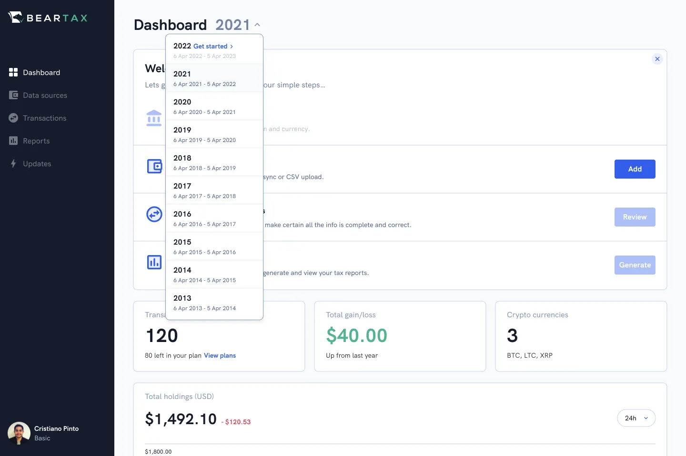
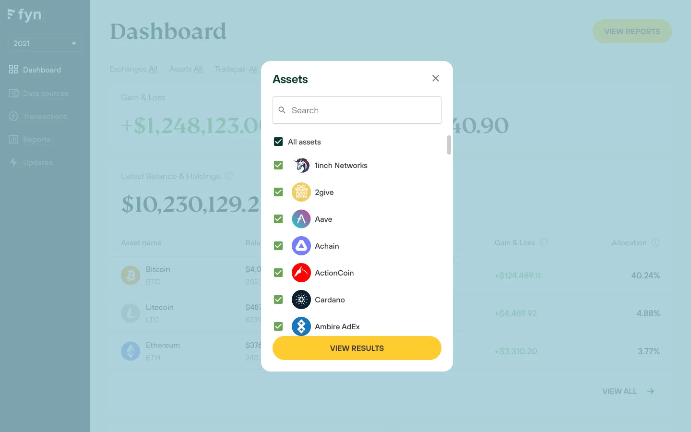
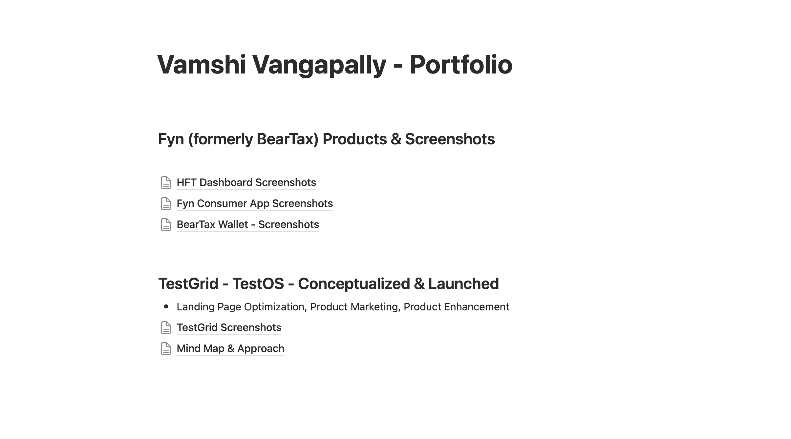
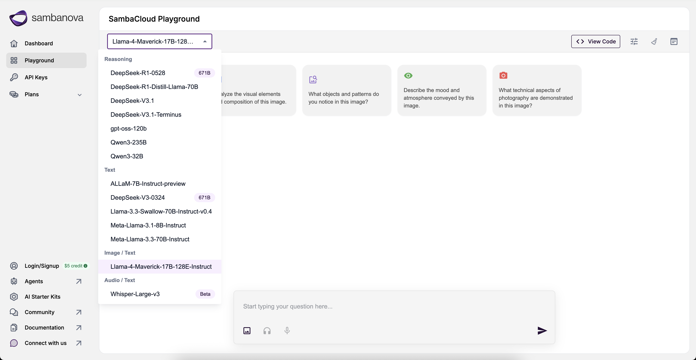
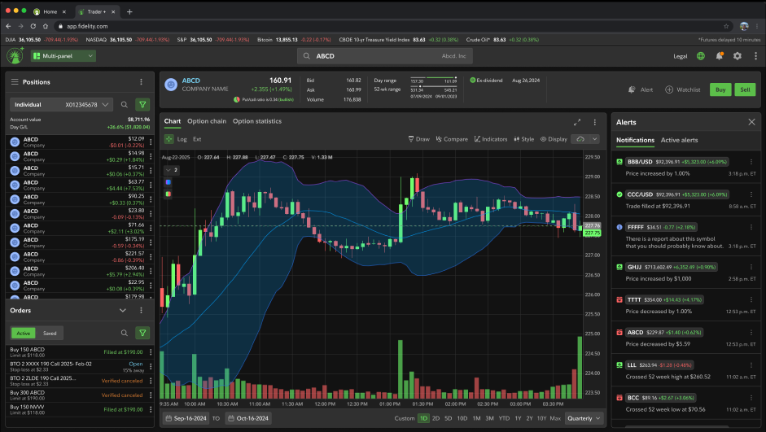

# 👷 Vamshi Vangapally

#### UI/UX Specialist | Fintech/Web3 Entrepreneur

## About Me

A seasoned product engineer with 15 years of experience bridging technology and user needs. I combine deep technical expertise with UX design and Web3 knowledge to build products that matter. My strength lies in translating complex business requirements and customer needs into accessible solutions, with a particular focus on making Web3 technologies approachable for mainstream users.

## 📈 Impact

**UI/UX Development Advisory @ SambaNova Cloud**

- Led and implemented an interactive AI Playground showcasing large language models (LLMs) and NLP tasks, optimizing front-end performance for large inputs (up to 32K tokens) and advanced audio streaming features.
- Enabled developer tier with real-time, usage-based billing integrations (Stripe, internal usage metrics), multi-API-key management, and improved UX.
- Facilitated hyperscaler marketplace integrations, enhancing seamless API access, usage tracking, and billing.

**Principal Frontend Engineer @ Fidelity Investments**

- Built trading experiences and architecture supporting equity, mutual fund, recurring investments, and multiple trading types through Trade and Trader+ platforms.
- Led frontend architecture, maintenance, and innovation initiatives to enhance user trading experiences.
- Delivered scalable solutions for high-volume trading systems used by millions of customers.

**Head of Product @ Fyn**

- Rebranded to Fyn post-acquisition, targeting B2B customers in high-frequency trading and tax reporting.
- Leading a 15-member product and engineering team across three major product lines.
- Built infrastructure aggregating data from 60+ providers, processing 30K TPS, and serving tax documents in 25 countries.
- Raised $3.3M pre-seed round led by Ascend VC, Hustle Fund, and Seattle-based investors.

**Founder @ BearTax (Product, Marketing & GTM)**

- Successfully transitioned product from concept to market launch.
- Led product strategy, integrations, tax engine development, document generation, and payment solutions.
- Achieved customer growth of 35K users across 5 countries, managing 100M transactions from 45K+ wallets.

## 🌐 YouTube Demos & Previous Work

<table>
<tr>
<td width="33.33%" align="center">

 
<em>Tax Product Demo</em>
</td>
<td width="33.33%" align="center">

 
<em>High Frequency Data Product</em>
</td>
<td width="33.33%" align="center">

 
<em>Fyn Products & Screenshots</em>
</td>
</tr>
<tr>
<td width="33.33%" align="center">

 
<em>SambaNova Cloud - AI Inference Platform</em>
</td>
<td width="33.33%" align="center">

 
<em>Fidelity Trading Systems - Trade & Trader+</em>
</td>
<td width="33.33%" align="center">
</td>
</tr>
</table>

## 💡 Design Skills

- **Design**: UI/UX, Interaction Design, Visual Design
- **Tools**: Figma, Sketch, Adobe Suite
- **Methods**: User Research, Wireframing, Prototyping

## 💡 Development Skills

- **Languages**: JavaScript, TypeScript, Python, CSS
- **Libraries & Frameworks**: Angular, React, NextJS, TailwindCSS, RadixUI

## 💡 Marketing Skills

- **Product Marketing**: GTM Strategy, Planning, Partnerships, DevRel, Product Launch
- **Sales & Marketing**: Landing Page Optimization, Programmatic SEO, Inbound Marketing, Lead Gen

## 🛠️ Developer Assist Tools

- **AI Coding Assistants**: Cursor & Windsurf for personal projects, Copilot for some clients
- **Prototyping**: Vercel v0 for initial prototyping
- **Deployment & Hosting**: Vercel & Netlify for managing personal project deployments

## 🌐 Connect

- [LinkedIn](https://linkedin.com/in/vamshi4001)
- [Twitter](https://twitter.com/idohodl)
- [Photography](https://500px.com/vamshi4001)

---

_For collaborations or opportunities, reach out via [vamshireddy.ui@gmail.com]_
